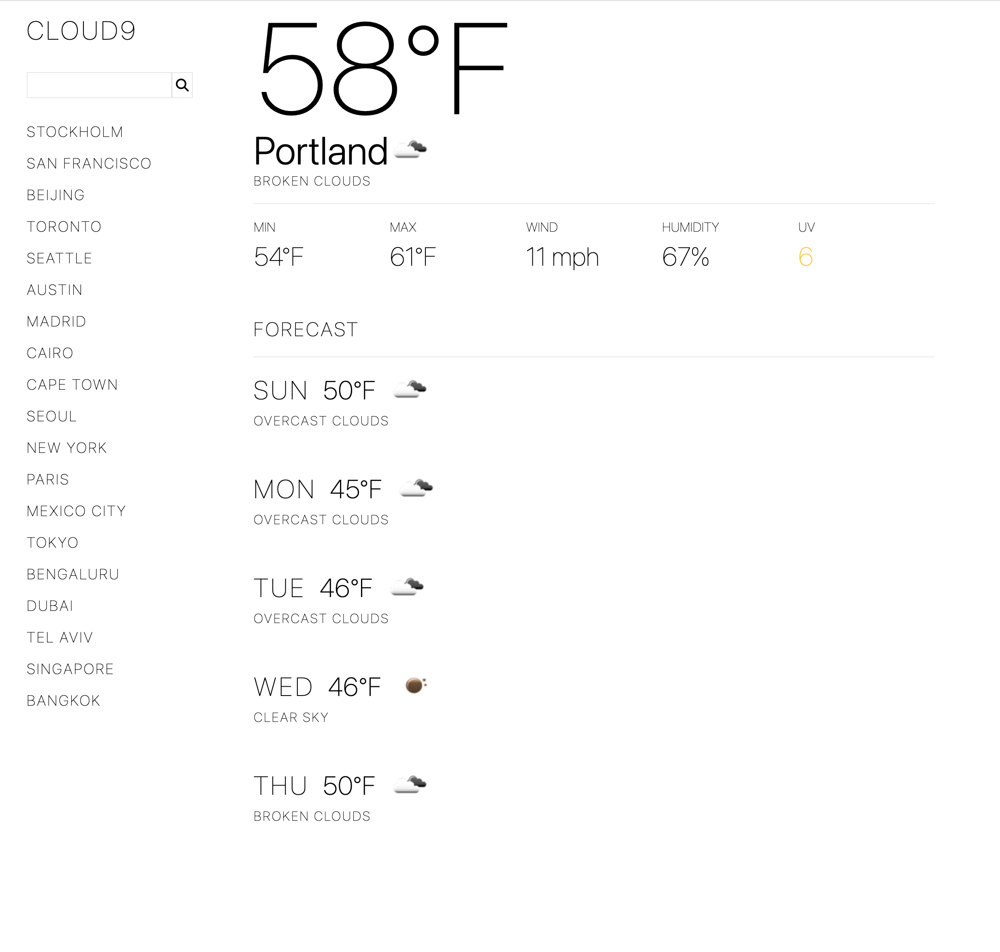

# Weather Dashboard

Weather dashboard for searching weather data and forecast by city. Weather data is provided by Open Weather API.

The application allows the user to search for the weather by city name. The application will save the user's recent searches and load the previous search when the user returns to the app.

This is a front-end application built with Vue.js.

[https://cloud9-weather.netlify.app/](https://cloud9-weather.netlify.app/)

## Technologies

- Vue.js
- Vite.js
- JavaScript
- HTML5
- CSS3
- TailwindCSS

## Image
